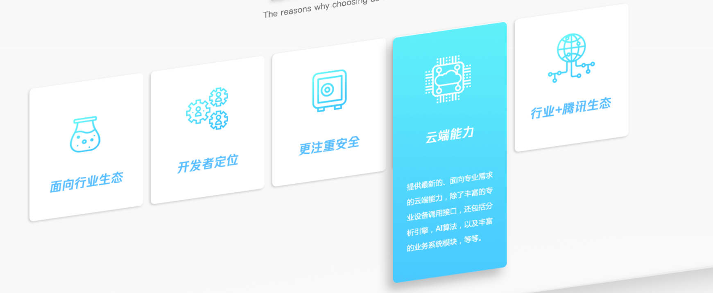

# Card
实习的部门是腾讯微瓴物联平台，昨天再看官网的时候，发现一个挺好看的card组件决定自己写一个看看。


## 效果


<CardMe title="爱你" desc="爱我" style="margin:30px"></CardMe>

## 使用方法

``` vue
<CardMe title="爱你" desc="爱我"></CardMe>
```

## 实现方法

```vue
<template>
  <div class="card">
    <div class="title">{{title}}</div>
    <div class="desc">{{desc}}</div>
  </div>
</template>

<script>
  export default {
    name: "card-me",
    props:['title','desc']
  }
</script>

<style scoped lang="scss">
  .card {
    background-color: #eeeeee;
    width: 300px;
    text-align: center;
    box-shadow: #777777 0 0 100px 2px;
    transform: skewY(-0.1rad);
    border-radius: 10px;
    height: 210px;
    color: cornflowerblue;
    transition: 0.3s padding-top,0.5s 0.3s height cubic-bezier(0.19, 1, 0.22, 1);
    &:hover {
      background-color: cornflowerblue;
      color: white;
      padding-top: 20px;
      height: 430px;
      .desc{
        opacity: 1;
        transition: 1s 0.3s opacity cubic-bezier(0.19, 1, 0.22, 1);
      }
    }
    .title {
      font-size: 2rem;
      font-weight: bold;
    }
    .desc {
      opacity: 0;
    }
  }
</style>

```
